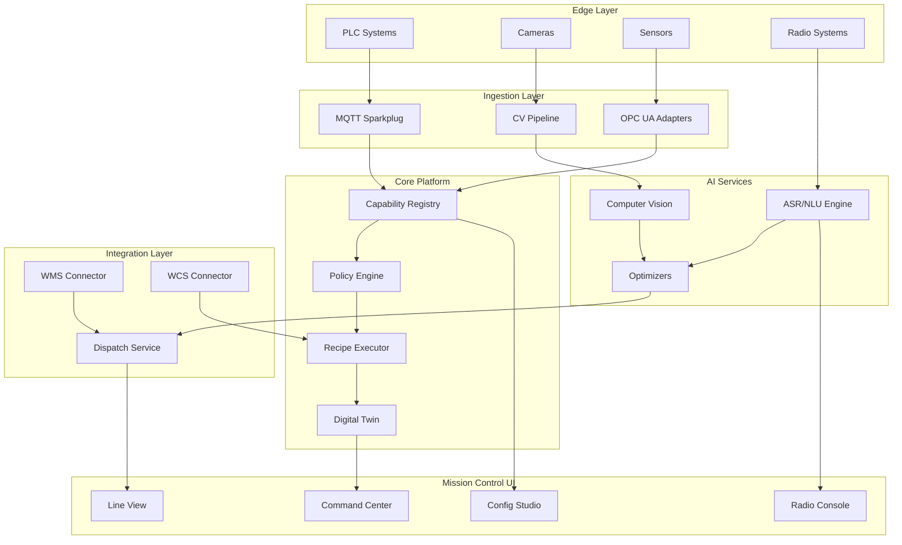

# NeuroLogix

> **Enterprise-Grade AI-Powered Industrial Control System**
>
> _Mission-critical automation platform for warehouse & industrial operations_

[](LICENSE)
[](https://www.typescriptlang.org/)
[](https://turbo.build/)
[](https://www.isa.org/standards-and-publications/isa-standards/isa-standards-committees/isa62443/)

## 🎯 Mission Statement

NeuroLogix is a state-of-the-art AI-powered Industrial Control System that
orchestrates warehouse and industrial automation through a **safety-first,
AI-augmented approach**. Built to NASA mission control standards with
Google-scale architecture and Microsoft enterprise reliability.

### Core Principles

- **Safety First**: AI never bypasses PLC interlocks; all control flows through
  validated recipes
- **Deterministic**: Predictable, auditable, and compliant with IEC 62443 /
  ISA-95 / ISO 27001
- **Modular**: Capabilities can be added/removed without core system changes
- **Observable**: Complete telemetry, tracing, and audit trails for every action
- **Scalable**: Designed for 10k+ tags/second with millisecond response times

## 🏗️ Architecture Overview



## 📦 Monorepo Structure

```
neurologix/
├── apps/                    # Applications
│   ├── mission-control/     # Primary operator interface
│   ├── edge-gateway/        # Edge data collection
│   └── simulator/           # Training/testing environment
├── packages/                # Shared libraries
│   ├── core/               # Core utilities & types
│   ├── schemas/            # Data contracts & validation
│   ├── security/           # Auth, RBAC, crypto utilities
│   ├── observability/      # Metrics, logs, traces
│   ├── adapters/           # Protocol adapters (OPC UA, MQTT, etc.)
│   ├── ai/                 # AI/ML utilities & models
│   └── ui/                 # Shared UI components
├── services/               # Backend microservices
│   ├── capability-registry/ # Plugin/capability management
│   ├── policy-engine/      # OPA-based policy decisions
│   ├── recipe-executor/    # Safe automation sequences
│   ├── digital-twin/       # Asset modeling & simulation
│   ├── dispatch/           # Task orchestration
│   ├── asr-engine/         # Speech recognition service
│   └── cv-processor/       # Computer vision pipeline
├── infrastructure/         # IaC & deployment configs
│   ├── docker/             # Container definitions
│   ├── kubernetes/         # K8s manifests
│   ├── terraform/          # Cloud infrastructure
│   └── helm/               # Helm charts
├── docs/                   # Documentation
│   ├── architecture/       # System design & ADRs
│   ├── api/               # API documentation
│   ├── deployment/        # Deployment guides
│   ├── compliance/        # Security & regulatory docs
│   └── runbooks/          # Operational procedures
└── tools/                 # Development & build tools
    ├── codegen/           # Code generators
    ├── testing/           # Test utilities
    └── ci/                # CI/CD scripts
```

## 🚀 Quick Start

### Prerequisites

- **Node.js** 20.10.0+ (managed via Volta)
- **Docker** 24.0+ with Compose V2
- **Kubernetes** 1.28+ (for production deployment)
- **Git** with signed commit support

### Development Setup

```bash
# Clone repository
git clone https://github.com/Coding-Krakken/NeuroLogix.git
cd NeuroLogix

# Install dependencies
npm install

# Set up git hooks
npm run prepare

# Start development environment
npm run dev

# Run all tests
npm test

# Build for production
npm run build
```

### Docker Development

```bash
# Start all services
docker compose -f infrastructure/docker/docker-compose.dev.yml up

# Start specific service
docker compose -f infrastructure/docker/docker-compose.dev.yml up mission-control

# View logs
docker compose logs -f capability-registry
```

## 📋 Development Phases

### ✅ Phase 0 — Foundations (Current)

- [x] Monorepo structure with Turbo
- [x] TypeScript configuration
- [x] ESLint + Prettier + Husky
- [ ] CI/CD pipelines
- [ ] Observability stack setup
- [ ] Security baseline
- [ ] Architecture documentation

### 🔄 Phase 1 — Data Spine & Contracts

- [ ] Schema definitions (Zod + JSON Schema)
- [ ] Message broker setup (MQTT + Kafka)
- [ ] Contract testing framework
- [ ] Topic ACLs & security

### ✅ Phase 2 — Core Runtime

- [x] Capability Registry service
- [x] Policy Engine (OPA/Rego)
- [x] Recipe Executor with safety checks
- [x] Digital Twin foundation

### ⏳ Phase 3 — Edge & Adapters

- [ ] OPC UA/MQTT Sparkplug adapters
- [ ] Camera ingestion pipeline
- [ ] Demo line simulator

### ⏳ Phase 4 — AI Services

- [ ] ASR/NLU for radio communications
- [ ] Computer Vision models
- [ ] Optimization algorithms

### ⏳ Phase 5 — WMS/WCS Integration

- [ ] WMS connector
- [ ] WCS connector
- [ ] Dispatch service

### ⏳ Phase 6 — Mission Control UI

- [ ] React-based operator interface
- [ ] Real-time data visualization
- [ ] Accessibility compliance

### ⏳ Phase 7 — Security & Compliance

- [ ] IEC 62443 alignment
- [ ] mTLS implementation
- [ ] Audit trail system

### ⏳ Phase 8 — Testing & Validation

- [ ] E2E scenario testing
- [ ] Performance benchmarking
- [ ] Chaos engineering

### ⏳ Phase 9 — Multi-Site Federation

- [ ] Site template system
- [ ] Federation architecture
- [ ] Controlled rollout mechanisms

## 🛡️ Security & Compliance

### Standards Alignment

- **IEC 62443**: Industrial cybersecurity framework
- **ISA-95**: Enterprise-control system integration
- **ISO 27001**: Information security management
- **NIST Cybersecurity Framework**: Risk management approach

### Security Features

- Zero-trust architecture
- mTLS for all inter-service communication
- RBAC/ABAC with zone-based access control
- Immutable audit logging
- Supply chain security (SBOM, signed containers)
- Regular penetration testing

## 📊 Observability

### Metrics

- **Prometheus** for metrics collection
- **Grafana** for visualization
- **Custom SLI/SLO** dashboards for each service

### Logging

- **Structured logging** (JSON format)
- **ELK Stack** for log aggregation
- **Audit trails** for regulatory compliance

### Tracing

- **OpenTelemetry** for distributed tracing
- **Jaeger** for trace visualization
- **Performance profiling** for optimization

## 🧪 Testing Strategy

### Test Pyramid

- **Unit Tests**: ≥90% coverage on core modules
- **Integration Tests**: Service-to-service contracts
- **E2E Tests**: Complete workflow validation
- **Performance Tests**: Load & stress testing
- **Security Tests**: Automated vulnerability scanning

### Quality Gates

- All PRs require passing CI/CD pipeline
- Code review from security & architecture teams
- Automated dependency vulnerability scanning
- Performance regression detection

## 📚 Documentation

- **[Architecture Decision Records](docs/architecture/README.md)**: Design
  decisions & trade-offs
- **[API Documentation](docs/api/README.md)**: Service interfaces & contracts
- **[Deployment Guide](docs/deployment/README.md)**: Installation &
  configuration
- **[Compliance Guide](docs/compliance/README.md)**: Regulatory alignment
- **[Runbooks](docs/runbooks/README.md)**: Operational procedures

## 🤝 Contributing

See [CONTRIBUTING.md](CONTRIBUTING.md) for development guidelines, code
standards, and submission process.

## 📄 License

This software is proprietary and confidential. Unauthorized copying,
modification, or distribution is strictly prohibited.

---

**Built with ❤️ for industrial automation excellence**
